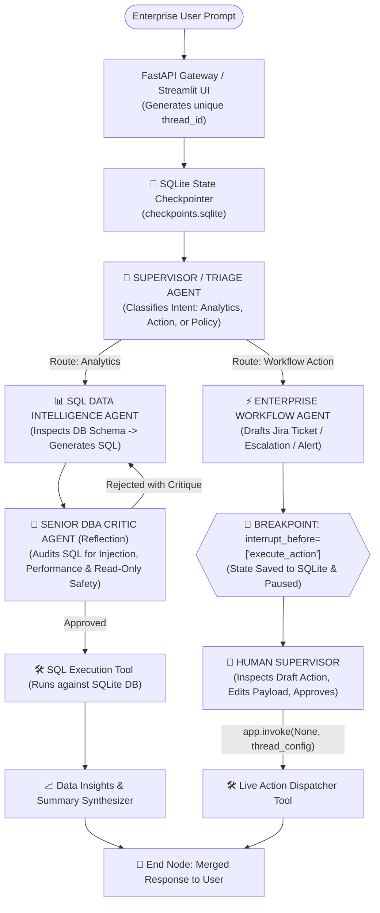

# 🏢 EnterpriseIQ / AngelPulse: Autonomous Multi-Agent Enterprise Data & Workflow Swarm

> **Target Role Alignment:** Agentic AI Intern @ Angel One (Bengaluru)  
> **Repository Name:** `Autonomous-Multi-Agent-Enterprise-Data-and-Workflow-Swarm`  
> **Status:** Architecture & Engineering Specification (PRD & TRD)  
> **Author:** Nikil R (Agentic AI Systems Engineer)  
> **Core Mission:** Deliver a production-grade multi-agent swarm that empowers non-technical enterprise employees to talk to internal databases in plain English, automate business workflows, and safely escalate sensitive actions to human operators via Human-in-the-Loop (HITL) checkpoints.

---

## 📑 TABLE OF CONTENTS
1. [Product Requirements Document (PRD)](#1-product-requirements-document-prd)
   - 1.1 Executive Summary & Problem Statement
   - 1.2 Target User Personas
   - 1.3 Core Business Capabilities & Feature Set
   - 1.4 Success Metrics (KPIs)
2. [Technical Requirements Document (TRD)](#2-technical-requirements-document-trd)
   - 2.1 Complete Architectural Diagram
   - 2.2 Multi-Agent Swarm Topology & Personas
   - 2.3 Real Tools & Operational Sandboxes
   - 2.4 State Schema & Reducer Architecture
   - 2.5 State Persistence & Checkpointer Engine
   - 2.6 Human-in-the-Loop (HITL) Safety & Breakpoint Design
   - 2.7 Production Tech Stack & Library Specifications
3. [Phased Implementation Roadmap](#3-phased-implementation-roadmap)
   - Phase 1: Database Seed & Mock Enterprise Infrastructure
   - Phase 2: Tool Engineering & Schema Definitions
   - Phase 3: LangGraph Agent Swarm & Conditional Routing
   - Phase 4: State Checkpointing & HITL Breakpoint Pipeline
   - Phase 5: FastAPI Production Server & Session Isolation
   - Phase 6: Streamlit / Frontend Interactive Enterprise Dashboard
4. [Interview Defense & Resume Narrative](#4-interview-defense--resume-narrative)

---

## 1. PRODUCT REQUIREMENTS DOCUMENT (PRD)

### 1.1 Executive Summary & Problem Statement
In modern enterprises like Angel One:
1. **The Data Bottleneck:** Non-technical employees (Product Managers, HR, Operations, Support Leads) spend hours waiting for data analysts to write SQL queries just to answer basic questions (e.g., *"Which customer cohorts had the highest churn after the last platform update?"* or *"How many trading accounts were opened this week?"*).
2. **The Automation Fear:** Executives fear letting AI take direct action in enterprise tools because an autonomous agent might delete database rows, issue duplicate refunds, or trigger erroneous high-priority tickets.
3. **The Solution:** **EnterpriseIQ** solves both problems simultaneously:
   - **Talk-to-Data Engine:** Turns plain-English questions into validated, safe SQL queries, executes them against an enterprise SQL database, and synthesizes answers into actionable business summaries and charts.
   - **Enterprise Workflow Engine:** Connects to ticketing and notification systems with an **autonomous safety gate** (Human-in-the-Loop) that automatically halts before sensitive operations, requiring human supervisor sign-off before proceeding.

### 1.2 Target User Personas
* **Persona A: Business / Product Manager:** Wants immediate answers to metrics without knowing SQL or waiting for BI teams.
* **Persona B: People Ops / HR Lead:** Wants to query headcount, attrition patterns, and training metrics in natural language.
* **Persona C: Enterprise Compliance / Department Lead (The Human Approver):** Receives structured notifications when an agent proposes a destructive change, reviews the proposed action, edits if needed, and clicks "Approve".

### 1.3 Core Business Capabilities & Feature Set

| Feature ID | Capability | Description |
|---|---|---|
| **FEAT-01** | **Natural Language to Data Insights** | Converts conversational queries into safe SQL, executes them on an enterprise database, and generates analytical summaries. |
| **FEAT-02** | **Reflection & SQL Safety Audit** | A dedicated Critic agent scans all generated SQL to block destructive operations (`DROP`, `DELETE`, `UPDATE` without `WHERE`), and validates syntax against the schema. |
| **FEAT-03** | **Automated Enterprise Action Dispatch** | Generates incident tickets, triggers departmental alerts, and updates task statuses. |
| **FEAT-04** | **Human-in-the-Loop (HITL) Breakpoint** | Freezes execution whenever a proposed action modifies state or carries high operational impact, persisting state until a human reviews and resumes. |
| **FEAT-05** | **Session Isolation & Multi-Tenancy** | Every user/session runs under a dedicated `thread_id` backed by an SQLite persistence store. |
| **FEAT-06** | **Time-Travel & Audit Trail** | Full provenance of all agent thoughts, tool executions, and human interventions are preserved and queryable for compliance audits. |

---

## 2. TECHNICAL REQUIREMENTS DOCUMENT (TRD)

### 2.1 Complete Architectural Diagram



---

### 2.2 Multi-Agent Swarm Topology & Personas

The system features **4 Specialized Agents** collaborating over a shared state:

1. **👑 The Orchestrator / Supervisor Agent (`supervisor_node`)**
   - **Role:** Central triage router.
   - **Function:** Analyzes incoming user requests, checks what state variables have already been populated, and delegates to the appropriate specialist (`ANALYTICS_PATH`, `WORKFLOW_PATH`, or `FINISH`).
   - **Tools:** Router structured output.

2. **📊 The Data Intelligence Specialist (`sql_generator_node`)**
   - **Role:** Text-to-SQL engineer.
   - **Function:** Reads database schema information, generates optimized SQL queries with joins, filters, and aggregations.
   - **Tools:** `get_database_schema_tool`.

3. **🧐 The Senior DBA Security Critic (`sql_dba_critic_node`)**
   - **Role:** Reflection & Security Auditor.
   - **Function:** Scans queries to enforce strictly read-only execution (`SELECT` only; rejects any `DROP`, `TRUNCATE`, `ALTER`), checks for table scan performance, and formats queries. If flawed, loops back to the Generator with corrective feedback.

4. **⚡ The Enterprise Workflow Specialist (`workflow_action_node`)**
   - **Role:** Action dispatcher.
   - **Function:** Drafts Jira tickets, departmental alerts, and email notifications with structured payloads.
   - **Constraint:** Does NOT execute directly; routes immediately to the **Human Breakpoint**.

---

### 2.3 Real Tools & Operational Sandboxes

Our swarm is equipped with real Python domain functions:

1. `inspect_schema_tool()`: Returns live tables, column names, foreign keys, and sample rows from the enterprise database.
2. `execute_sql_query_tool(query: str)`: Executes read-only queries against the database and returns structured JSON rows.
3. `create_enterprise_ticket_tool(title: str, severity: str, details: str)`: Simulates creating a ticket in Jira/ServiceNow.
4. `send_slack_alert_tool(channel: str, message: str)`: Dispatches a priority notification.

---

### 2.4 State Schema & Reducer Architecture

```python
class EnterpriseSwarmState(TypedDict):
    user_query: str                          # Original user prompt
    thread_id: str                           # Unique session identifier
    intent_category: str                     # "DATA_ANALYTICS" | "WORKFLOW_ACTION" | "GENERAL"
    
    # Data Path States
    sql_query: Optional[str]                 # Generated SQL query
    dba_feedback: Optional[str]              # Critic feedback if rejected
    sql_approval_status: str                 # "PENDING" | "APPROVED" | "REJECTED"
    query_results: Optional[str]             # JSON string of executed SQL results
    data_insights_summary: Optional[str]     # Executive explanation of numbers
    
    # Workflow / Action Path States
    action_payload: Optional[dict]           # Drafted ticket/alert payload
    human_approved: bool                     # Human supervisor sign-off flag
    action_execution_result: Optional[str]   # Result of executing tool
    
    # Swarm Loop & Diagnostics
    iteration_count: int                     # Circuit breaker limit
    next_node: str                           # Next node to execute
```

---

### 2.5 State Persistence & Checkpointer Engine

* **Persistence Layer:** `SqliteSaver` connected to `checkpoints.sqlite`.
* **Behavior:**
  - After every agent turn, state is written to SQLite tables (`checkpoints`, `checkpoint_writes`).
  - If the server restarts mid-session, the workflow resumes seamlessly from disk using `thread_id`.

---

### 2.6 Human-in-the-Loop (HITL) Safety & Breakpoint Design

```python
app = workflow.compile(
    checkpointer=checkpointer,
    interrupt_before=["execute_action_tool_node"]  # 🛑 SAFETY GATE
)
```

1. **Pause Trigger:** Whenever an action modifies data or sends notifications, execution halts automatically.
2. **State Inspection:** Human reviewer views `app.get_state(config).values["action_payload"]`.
3. **State Mutation:** Human can edit details via `app.update_state(config, {"action_payload": modified_payload, "human_approved": True})`.
4. **Resumption:** Calling `app.invoke(None, config=config)` triggers execution of the approved payload.

---

### 2.7 Production Tech Stack & Library Specifications

| Component | Technology | Rationale |
|---|---|---|
| **Orchestration** | `langgraph >= 0.2.0`, `langgraph-checkpoint-sqlite` | State-machine graphs, conditional branching, SQLite persistence, native HITL. |
| **Inference Engine** | Groq API (`qwen/qwen3.8-27b`) | Ultra-fast token latency (<500ms TTFT) for smooth multi-agent loops. |
| **Backend API** | `fastapi`, `uvicorn`, `pydantic` | Production-ready REST endpoints for session initiation, state inspection, and approval. |
| **Database** | `sqlite3` (Mock Angel One Trading & Customer DB) | Zero external dependencies; self-contained enterprise relational database with customers, trades, accounts, and tickets. |
| **Frontend UI** | `streamlit` | Clean, interactive dashboard for testing chat, viewing SQL results, and approving HITL breakpoints. |

---

## 3. PHASED IMPLEMENTATION ROADMAP

```
┌────────────────────────────────────────────────────────────────────────┐
│                        IMPLEMENTATION PHASES                           │
└────────────────────────────────────────────────────────────────────────┘

[Phase 1] Seed Mock Enterprise Relational Database (Customers, Trades, Tickets)
    │
[Phase 2] Build Domain Tools (Schema Inspector, Safe SQL Runner, Ticket Creator)
    │
[Phase 3] Construct LangGraph State Machine (Supervisor, SQL Gen, DBA Critic, Action Agent)
    │
[Phase 4] Wire SqliteSaver Checkpointer & HITL Breakpoint Gate
    │
[Phase 5] Build FastAPI Production Service with Session Endpoints
    │
[Phase 6] Build Interactive Streamlit Dashboard & Live Verification
```

---

## 4. INTERVIEW DEFENSE & RESUME NARRATIVE

### How to Present This on Your Resume:
> **EnterpriseIQ — Autonomous Multi-Agent Enterprise Data & Workflow Swarm**  
> *Python, LangGraph, FastAPI, Groq, SQLiteSaver, Pydantic, Streamlit*
> - Engineered an autonomous multi-agent enterprise platform using LangGraph featuring 4 specialized agents (Supervisor Router, SQL Data Intelligence, DBA Security Critic, and Workflow Action Dispatcher).
> - Implemented an automated Text-to-SQL reflection loop that generates, audits, and executes relational database queries against an enterprise schema with zero SQL injection vulnerability.
> - Designed an enterprise Human-in-the-Loop (HITL) safety architecture utilizing `interrupt_before` breakpoints and `SqliteSaver` persistence, allowing managers to inspect, edit, and approve critical workflow actions.
> - Deployed a high-throughput FastAPI service with multi-tenant session isolation (`thread_id`) and time-travel audit trails for complete compliance observability.

### Answers to Tough Interviewer Questions:
1. **"Why not just use a single prompt with function calling?"**  
   *Answer:* A single prompt cannot maintain the adversarial rigor needed to audit its own SQL queries, easily suffers from prompt injection, and cannot pause execution cleanly for human intervention without complex state loss.
2. **"How do you prevent agents from hallucinating database schemas?"**  
   *Answer:* The SQL Generator agent does not guess column names; it runs an explicit `inspect_schema_tool` to dynamically read SQLite table structures and foreign keys into its context before authoring any query.
3. **"What happens if your server crashes while waiting for human approval?"**  
   *Answer:* The state is persisted in `checkpoints.sqlite` using LangGraph's checkpointer. The server can restart days later, load the snapshot via `thread_id`, and resume right where it left off.
