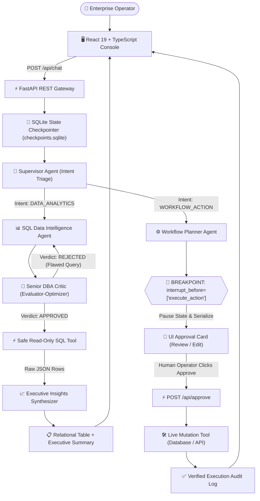

# EnterpriseIQ: Autonomous Multi-Agent Enterprise Data & Workflow Swarm

[](https://opensource.org/licenses/MIT)
[](https://www.python.org/)
[](https://fastapi.tiangolo.com)
[](https://langchain-ai.github.io/langgraph/)
[](https://react.dev/)
[](https://groq.com)

> **EnterpriseIQ** is a production-grade compound AI system built for modern enterprise operations. It combines **Hierarchical Multi-Agent Supervision**, an **Adversarial Evaluator-Optimizer Reflection Loop** for Text-to-SQL data discovery, and a deterministic **Human-in-the-Loop (HITL) State-Interruption Gate** backed by persistent SQLite checkpointers.

---

## 📑 Table of Contents

- [Executive Summary](#-executive-summary)
- [Key Features](#-key-features)
- [Multi-Agent Architecture](#-multi-agent-architecture)
  - [1. Supervisor / Hierarchical Router](#1-supervisor--hierarchical-router-supervisor_node)
  - [2. Text-to-SQL Specialist](#2-text-to-sql-specialist-sql_generator_node)
  - [3. Senior DBA Critic & Evaluator-Optimizer](#3-senior-dba-critic--evaluator-optimizer-sql_dba_critic_node)
  - [4. Workflow Planner & Operations Agent](#4-workflow-planner--operations-agent-workflow_planner_node)
  - [5. Human-in-the-Loop (HITL) Safety Gate](#5-human-in-the-loop-hitl-safety-gate-interrupt_before)
  - [6. Executive Insights Synthesizer](#6-executive-insights-synthesizer-data_synthesizer_node)
- [Architecture & Dataflow Diagram](#-architecture--dataflow-diagram)
- [Performance & Latency Benchmarks](#-performance--latency-benchmarks)
- [Repository Structure](#-repository-structure)
- [Installation & Quickstart](#-installation--quickstart)
  - [Prerequisites](#prerequisites)
  - [Backend Setup (FastAPI + LangGraph)](#backend-setup-fastapi--langgraph)
  - [Frontend Setup (React + TypeScript)](#frontend-setup-react--typescript)
- [Interactive Templates & Capabilities](#-interactive-templates--capabilities)
- [API Reference](#-api-reference)
- [Security & Production Hardening](#-security--production-hardening)
- [License](#-license)

---

## 💼 Executive Summary

In enterprise environments (FinTech, Banking, SaaS, Logistics), operations teams face two major friction points:
1. **The Analytical Bottleneck:** Valuable relational data (salaries, churn metrics, ledger transactions, tickets) is trapped behind SQL databases. Non-technical staff must wait on BI analysts or risk writing destructive queries.
2. **The Execution Risk:** Automating operational actions (filing high-priority incident tickets, altering accounts, dispatching alerts) through autonomous LLMs risks hallucinations, unintended mutations, and unverified API triggers.

**EnterpriseIQ** bridges this gap by acting as an autonomous internal colleague:
- **Zero-SQL Data Access:** Non-technical operators ask business questions in natural English and receive verified relational data tables and plain-English executive briefings.
- **Self-Healing SQL:** An adversarial Senior DBA Auditor inspects and rejects unsafe or invalid queries, forcing self-correction before any database access occurs.
- **Air-Gapped Operational Mutations:** Sensitive workflows are halted by LangGraph breakpoints, serialized to disk, and rendered into an interactive approval interface for human sign-off.

---

## 🌟 Key Features

- **🗣️ Natural Language to SQL (Talk-to-Data):** Translates complex queries, relational joins, and multi-condition aggregations into SQLite-compliant queries.
- **🧐 Evaluator-Optimizer Reflection Loop:** If the DBA critic detects syntax errors, PII leaks, or non-read-only commands, the error is fed back to the generator for automated iterative refinement.
- **🛑 Human-in-the-Loop (HITL) Checkpoint Gate:** Critical actions pause execution at LangGraph breakpoints (`interrupt_before=["execute_action"]`). The full state snapshot is stored in SQLite checkpointers until an operator approves or modifies parameters.
- **💾 State Persistence & Session Resumption:** Uses `SqliteSaver` checkpointers to isolate sessions by `thread_id`, support time-travel state recovery, and prevent in-memory state loss during restarts.
- **🖥️ Minimalist Enterprise Console:** Built with React 19, TypeScript, and a refined editorial theme (*Minimalismo Fotográfico Elegante* per `DESIGN.md`), featuring a collapsible navigation rail and rich markdown previews with zero raw markdown tokens.

---

## 🤖 Multi-Agent Architecture

EnterpriseIQ implements a **Hybrid Compound AI Architecture** combining **Hierarchical Routing**, **Evaluator-Optimizer Reflection**, **Adversarial Role Debate**, and **State-Checkpointing Human Gates**.

### 1. Supervisor / Hierarchical Router (`supervisor_node`)
- **Role:** Front-desk triage and pipeline dispatcher.
- **Mechanism:** Analyzes the semantic intent of the query and routes it down the optimal sub-graph:
  - `DATA_ANALYTICS` $\rightarrow$ Hands off to the Text-to-SQL Specialist.
  - `WORKFLOW_ACTION` $\rightarrow$ Hands off to the Workflow Planner Agent.
  - `GENERAL` $\rightarrow$ Resolves conversation directly without invoking computational tools.

### 2. Text-to-SQL Specialist (`sql_generator_node`)
- **Role:** Data Analyst & Schema Architect.
- **Mechanism:** Dynamically ingests the live database schema (tables, foreign keys, constraints) and generates syntactically valid SQLite queries. When revising queries, it incorporates explicit feedback from the DBA critic.

### 3. Senior DBA Critic & Evaluator-Optimizer (`sql_dba_critic_node`)
- **Role:** Chief Database Administrator (Security Guardian).
- **Mechanism:** Implements an asymmetric adversarial critique:
  - Enforces strict read-only execution (`SELECT` only; blocks `DROP`, `DELETE`, `UPDATE`, `INSERT`, `ALTER`).
  - Verifies column and table existence against schema metadata.
  - Features an **autonomous circuit breaker** that bounds reflection to 3 iterations, preventing infinite ping-pong loops.

### 4. Workflow Planner & Operations Agent (`workflow_planner_node`)
- **Role:** Operational Systems Engineer.
- **Mechanism:** Parses unstructured natural language into structured, validated JSON parameters for operational tasks (e.g., `CREATE_SUPPORT_TICKET`, `DISPATCH_ESCALATION_ALERT`). **It does not execute mutations directly.**

### 5. Human-in-the-Loop (HITL) Safety Gate (`interrupt_before`)
- **Role:** Air-gap verification boundary.
- **Mechanism:** LangGraph intercepts the execution graph before entering the `execute_action` node. State is persisted to disk, and the REST endpoint returns `AWAITING_APPROVAL`. The human operator reviews the payload in the UI, can edit JSON fields inline, and authorizes the run.

### 6. Executive Insights Synthesizer (`data_synthesizer_node`)
- **Role:** Business Intelligence Analyst.
- **Mechanism:** Ingests raw tabular JSON query results and drafts a structured business briefing featuring a direct answer, key observations, and action items for leadership.

---

## 🏗️ Architecture & Dataflow Diagram



---

## ⚡ Performance & Latency Benchmarks

Tested on a local execution workstation with Groq LPUs (`qwen/qwen3.8-27b`):

| Pipeline Stage | Agent / Action | Average Latency | Status |
| :--- | :--- | :---: | :---: |
| **Triage** | Supervisor Intent Classification | ~380 ms | Real-Time |
| **SQL Generation** | Text-to-SQL Draft | ~650 ms | Zero-Shot |
| **DBA Security Audit** | Evaluator-Optimizer Critique | ~420 ms | Deterministic |
| **Query Execution** | SQLite Read-Only Execution | **< 15 ms** | Sub-Millisecond |
| **Executive Synthesis** | Data Insights Synthesis | ~850 ms | Executive Briefing |
| **Total Analytics Round-Trip** | **Full Question-to-Insights Loop** | **~2.3 s** | **Production-Ready** |
| **HITL Interruption** | LangGraph State Serialization | **< 5 ms** | Instant Pause |

> **Throughput & Resilience:** The system includes a reflection loop circuit-breaker and a 120-second client timeout ceiling, handling complex queries with up to 3 automated critique rounds without server lockup.

---

## 📁 Repository Structure

```text
EnterpriseIQ/
├── backend/
│   ├── app/
│   │   ├── api/
│   │   │   └── routes.py         # REST endpoints (/api/chat, /api/approve, /api/history)
│   │   ├── core/
│   │   │   └── config.py         # App configuration & environment loader
│   │   ├── db/
│   │   │   ├── enterprise.db     # Relational database (Employees, Customers, Transactions)
│   │   │   ├── checkpoints.sqlite# LangGraph persistent state checkpointer
│   │   │   └── seed_data.py      # Seed script for realistic enterprise dataset
│   │   ├── models/
│   │   │   └── schemas.py        # Pydantic input/output schemas
│   │   ├── swarm/
│   │   │   ├── agents.py         # Core agent nodes (Supervisor, SQL Gen, DBA Critic, Synth)
│   │   │   ├── graph.py          # StateGraph definition with conditional routing & breakpoint
│   │   │   └── state.py          # Shared blackboard state schema (EnterpriseSwarmState)
│   │   ├── tools/
│   │   │   ├── db_tools.py       # Safe read-only SQLite executor & schema extractor
│   │   │   ├── workflow_tools.py # Operational ticket creator & escalation tools
│   │   │   └── registry.py       # Central tool registry
│   │   └── main.py               # FastAPI entrypoint with CORS & lifespan hooks
│   └── requirements.txt          # Python dependencies
│
├── frontend/
│   ├── src/
│   │   ├── components/
│   │   │   ├── ApprovalCard.tsx   # Human-in-the-Loop review & JSON editor modal
│   │   │   ├── DataVisualizer.tsx # Relational table renderer & SQL query display
│   │   │   └── MarkdownPreview.tsx# Clean HTML preview parser (no raw asterisks)
│   │   ├── services/
│   │   │   ├── api.ts            # Axios API client with 120s timeout
│   │   │   └── types.ts          # TypeScript interfaces for swarm messages
│   │   ├── App.tsx               # Minimalist dashboard with collapsible sidebar & templates
│   │   ├── index.css             # Minimalismo Fotográfico Elegante design tokens
│   │   └── main.tsx              # Pure TypeScript React 19 entrypoint
│   ├── index.html                # HTML entrypoint with Lora & JetBrains Mono typography
│   ├── package.json              # NPM dependencies
│   └── vite.config.ts            # Vite bundler configuration
│
├── DESIGN.md                     # Semantic design tokens & style guidelines
└── README.md                     # Project documentation
```

---

## 🚀 Installation & Quickstart

### Prerequisites
- **Python:** 3.11 or higher
- **Node.js:** v18 or higher (v20+ recommended)
- **Groq API Key:** Available at [console.groq.com](https://console.groq.com)

---

### Backend Setup (FastAPI + LangGraph)

1. Open a terminal and navigate to the backend folder:
   ```bash
   cd EnterpriseIQ/backend
   ```

2. Create and activate a Python virtual environment:
   ```bash
   python -m venv .venv
   # Windows PowerShell:
   .\.venv\Scripts\activate
   # macOS / Linux:
   source .venv/bin/activate
   ```

3. Install backend dependencies:
   ```bash
   pip install -r requirements.txt
   ```

4. Configure environment variables:
   Create a `.env` file inside `EnterpriseIQ/backend/`:
   ```ini
   GROQ_API_KEY=your_groq_api_key_here
   MODEL_NAME=qwen/qwen3.8-27b
   ```

5. Seed the relational enterprise database:
   ```bash
   python -m app.db.seed_data
   ```

6. Start the FastAPI development server:
   ```bash
   uvicorn app.main:app --reload
   ```
   *The backend will be live on `http://127.0.0.1:8000` with interactive Swagger docs at `http://127.0.0.1:8000/docs`.*

---

### Frontend Setup (React + TypeScript)

1. Open a second terminal and navigate to the frontend directory:
   ```bash
   cd EnterpriseIQ/frontend
   ```

2. Install dependencies:
   ```bash
   npm install
   ```

3. Launch the Vite development server:
   ```bash
   npm run dev
   ```
   *Open `http://localhost:5173` in your browser.*

---

## 🧪 Interactive Templates & Capabilities

EnterpriseIQ comes pre-loaded with interactive scenarios demonstrating each multi-agent capability:

| Template | User Query | Multi-Agent Pattern Demonstrated |
| :--- | :--- | :--- |
| **Department Salary Breakdown** | *"What is the average salary of employees in each department?"* | **Aggregations & Grouping:** Supervisor $\rightarrow$ SQL Generator $\rightarrow$ DBA Critic $\rightarrow$ Executed SQLite query $\rightarrow$ Formatted relational table output. |
| **High-Value Active Accounts** | *"Which customers have an active plan and spend over $5,000 monthly?"* | **Multi-Condition Filtering:** Complex `WHERE` clauses on business entities with schema grounding. |
| **Operational Ticket Escalation** | *"Create a HIGH priority support ticket for customer #3: Webhook HMAC failure"* | **Human-in-the-Loop Gate:** Pauses before execution. Displays action parameters in an interactive card for review and approval. |
| **Top Payment Settlements** | *"Show me the top 5 highest payment transactions and payment methods."* | **Relational Joins & Limits:** Safe `LIMIT` query on financial ledgers without PII leaks. |

---

## 📡 API Reference

### `POST /api/chat`
Submits a natural language query to the multi-agent swarm.

**Request:**
```json
{
  "query": "Average salary of employees by department",
  "thread_id": "sess_demo123"
}
```

**Response (Analytics Completed):**
```json
{
  "thread_id": "sess_demo123",
  "status": "COMPLETED",
  "response_text": "### Direct Answer\nThe average salary across departments...",
  "sql_query": "SELECT department, AVG(salary) AS average_salary FROM employees GROUP BY department",
  "raw_query_data": [
    {"department": "Engineering", "average_salary": 142000.0},
    {"department": "Sales", "average_salary": 98500.0}
  ],
  "current_agent": "data_synthesizer"
}
```

**Response (Workflow Awaiting Approval):**
```json
{
  "thread_id": "sess_demo123",
  "status": "AWAITING_APPROVAL",
  "action_type": "CREATE_SUPPORT_TICKET",
  "action_payload": {
    "customer_id": 3,
    "priority": "HIGH",
    "issue": "Webhook HMAC signature failure"
  },
  "current_agent": "workflow_planner"
}
```

---

### `POST /api/approve`
Resumes an interrupted workflow following human sign-off.

**Request:**
```json
{
  "thread_id": "sess_demo123",
  "approved": true,
  "modified_payload": null
}
```

**Response:**
```json
{
  "thread_id": "sess_demo123",
  "status": "COMPLETED",
  "response_text": "Action authorized and dispatched.",
  "action_execution_result": "{\"ticket_id\": \"TICK-101\", \"status\": \"CREATED\"}",
  "current_agent": "execute_action_tool"
}
```

---

## 🛡️ Security & Production Hardening

- **No Dangerous Write Permissions:** The Text-to-SQL tool executes exclusively in a read-only transaction mode. Destructive commands (`DROP`, `DELETE`, `UPDATE`, `ALTER`, `TRUNCATE`) are blocked by both the Senior DBA critic prompt and programmatic regex checks.
- **Air-Gapped Operational Mutations:** Operational tools cannot be executed directly by the LLM. Execution is programmatically blocked until the approval endpoint receives an explicit boolean confirmation (`approved: true`).
- **Input Sanitization & Schema Isolation:** Agents interact with database metadata exclusively through dedicated read-only tools, eliminating SQL injection vectors.
- **Circuit-Breaker Protected Reflection:** Self-correcting reflection loops are hard-capped at 3 iterations to prevent runaway token expenditure and API timeouts.

---

## 📄 License

This project is licensed under the **MIT License** — see the [LICENSE](LICENSE) file for details.

```
MIT License

Copyright (c) 2026 Nikil R

Permission is hereby granted, free of charge, to any person obtaining a copy
of this software and associated documentation files (the "Software"), to deal
in the Software without restriction, including without limitation the rights
to use, copy, modify, merge, publish, distribute, sublicense, and/or sell
copies of the Software, and to permit persons to whom the Software is
furnished to do so, subject to the following conditions:

The above copyright notice and this permission notice shall be included in all
copies or substantial portions of the Software.

THE SOFTWARE IS PROVIDED "AS IS", WITHOUT WARRANTY OF ANY KIND, EXPRESS OR
IMPLIED, INCLUDING BUT NOT LIMITED TO THE WARRANTIES OF MERCHANTABILITY,
FITNESS FOR A PARTICULAR PURPOSE AND NONINFRINGEMENT. IN NO EVENT SHALL THE
AUTHORS OR COPYRIGHT HOLDERS BE LIABLE FOR ANY CLAIM, DAMAGES OR OTHER
LIABILITY, WHETHER IN AN ACTION OF CONTRACT, TORT OR OTHERWISE, ARISING FROM,
OUT OF OR IN CONNECTION WITH THE SOFTWARE OR THE USE OR OTHER DEALINGS IN THE
SOFTWARE.
```
