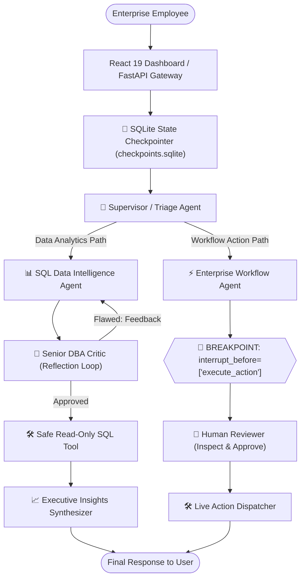

# Autonomous Multi-Agent Enterprise Data and Workflow Swarm

An enterprise-grade autonomous multi-agent platform built with **LangGraph**, **FastAPI**, and **React**. 

Empowers non-technical enterprise employees to query relational databases in plain English (Text-to-SQL with an adversarial DBA reflection loop), automate cross-department workflows, and safely escalate critical operations through a **Human-in-the-Loop (HITL)** approval gate backed by SQLite persistence.

---

## 🌟 Key Features

- **🗣️ Natural Language to SQL (Talk to Data):** Translates complex business questions into optimized SQL queries, joins across multiple tables, and delivers synthesized executive briefings.
- **🧐 Adversarial DBA Reflection Loop:** A dedicated Senior DBA Auditor agent continuously inspects generated queries for security (read-only enforcement, blocking destructive `DROP`/`DELETE`), schema validity, and index efficiency.
- **⚡ Autonomous Enterprise Workflow Engine:** Automatically files tickets, triggers incident alerts, and resolves support escalations.
- **🛑 Human-in-the-Loop (HITL) Safety Gate:** Leverages LangGraph breakpoints (`interrupt_before`) and persistent checkpointers to halt execution on sensitive operations until a human supervisor reviews, edits, and approves the action.
- **💾 State Persistence & Session Isolation:** Backed by `SqliteSaver` checkpointers, enabling multi-tenant `thread_id` session isolation, crash recovery, and full audit time-travel.
- **Modern Full-Stack Architecture:** High-throughput **FastAPI** backend with a responsive **React 19** frontend dashboard.

---

## 🏗️ Architecture Overview



---

## 📁 Repository Structure

```text
├── backend/
│   ├── app/
│   │   ├── api/          # FastAPI REST endpoints
│   │   ├── core/         # Configuration & environment variables
│   │   ├── db/           # Relational enterprise database & checkpointer
│   │   ├── models/       # Pydantic schemas (Request/Response contracts)
│   │   ├── swarm/        # LangGraph StateGraph, Agents & Routers
│   │   └── tools/        # Python domain tools (SQL runner, Ticket creator)
│   ├── requirements.txt  # Backend dependencies
│   └── main.py           # FastAPI ASGI entrypoint
├── frontend/             # React 19 + Vite dashboard
└── PLAN.md               # Product Requirements Document (PRD & TRD)
```

---

## 🛠️ Tech Stack

- **Orchestration:** LangGraph, LangGraph Checkpoint SQLite
- **LLM Engine:** Groq API (`qwen/qwen3.8-27b`)
- **Backend:** FastAPI, Uvicorn, Pydantic, aiosqlite
- **Frontend:** React 19, Vite, Axios, Lucide-React
- **Database:** SQLite3 (Enterprise Relational DB + State Checkpointer)
